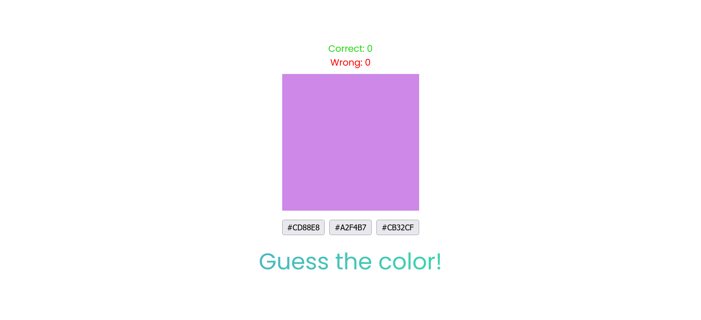
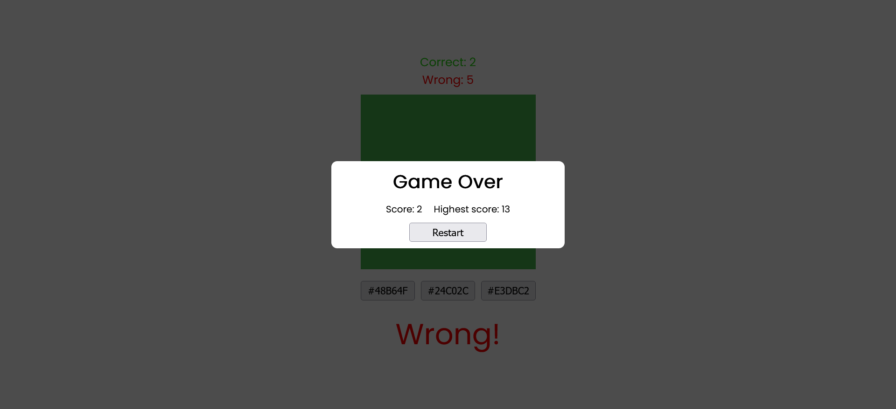

# React Color Guesser App


Live website: https://fatihbulbul1.github.io/react-color-guesser/

# Overview
Made by:
- **React**
- **React Hooks**
- Vite
- HTML
- CSS

### Fonts
```css
  @import url('https://fonts.googleapis.com/css2?family=Poppins&display=swap');
  font-family: 'Poppins', sans-serif;
  font-weight: 400;
```

## Description 
- Color guessing quiz app created by Vite, devoloped by React.
- Game ends when 5 wrong guesses made.
- High score will be saved to local storage and update if it'll be beaten.
- Restart button for restart game.


### Author
- LinkedIn - [Ömer Fatih Bülbül](https://www.linkedin.com/in/ömer-fatih-bülbül-74a890236/)
- Twitter - [fatihbulbul91](https://twitter.com/fatihbulbul91)
